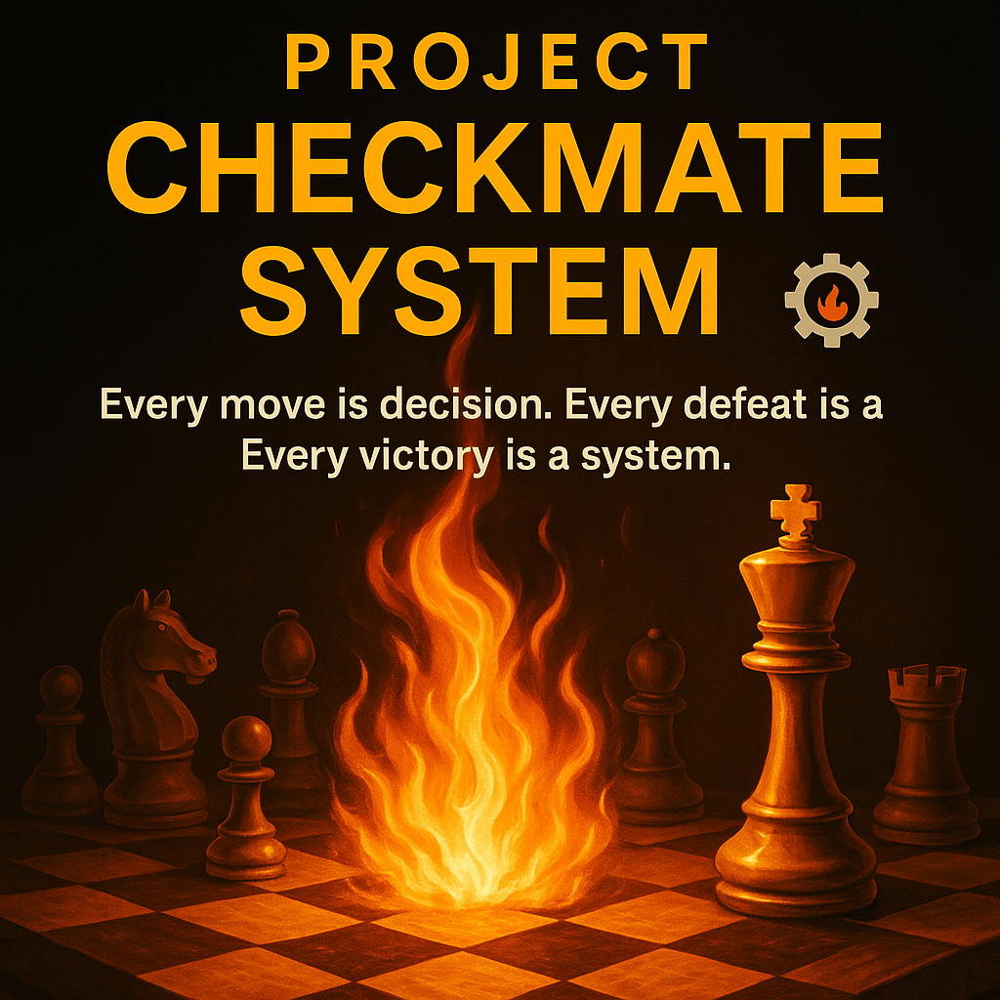

# 🏁 Project Checkmate System
> “Every move is a decision. Every defeat is data. Every victory is a system.” ⚙️🔥
## 🧠 Overview
**Project Checkmate System** is an **AI-driven business simulation game** where entrepreneurs play chess against the ultimate opponent — **Failure**.  
Each move represents a **strategic business decision**, and every defeat provides **data-driven feedback** to refine your model until it achieves real-world viability.

---

## 🎯 Goal
Transform traditional business planning into an **interactive feedback loop** powered by artificial intelligence, strategic reasoning, and gamified learning.

---

## 💀 Failure AI — The Final Boss
> “Failure isn’t an enemy — it’s a mirror. Every mistake teaches the system how to win smarter.”

**Role:**  
Failure AI is the adaptive opponent that learns from every player decision.  
Each defeat generates data, refining the entrepreneur’s logic, risk tolerance, and execution pattern.  
Every battle with Failure builds better systems.

**Mechanics:**  
♟️ *Defeat = Diagnostic Data* — Every mistake reveals a weak link.  
♛ *Adjustment = Refined Architecture* — Fix it, rebuild it, test it again.  
♚ *Victory = Implementation Ready* — When you beat Failure AI, your business design is simulation-verified for deployment.

---

## 💡 Vision
> “Failure isn’t the enemy — it’s the final instructor.”

The Checkmate System turns fear of failure into **fuel for refinement**, merging entrepreneurship, AI, and gamified intelligence into one framework.

---

## ⚡ Flame Division Seal

**Created by:** Commander Flame 🔥  
**Division:** Flame Division | AI Command Architecture  
**Phase V:** Game & Simulation Intelligence Protocol  
**Flame Law:** *“Every defeat teaches the next deployment.”* ⚙️🔥  

---

## 🏆 Victory Protocol Seal — The Proof of Mastery

> “When strategy aligns with execution, the system achieves equilibrium.”

**Symbolism:**  
Victory Protocol represents the player’s transformation from entrepreneur to system architect.  
Each successful decision sequence creates a verified business framework — an operational model that is simulation-proven and ethically scalable.

**Core Principles:**  
- ♟️ **Strategy = Awareness** — Understanding moves beyond the board.  
- ⚙️ **System = Alignment** — Every piece moves with purpose and order.  
- 🔥 **Mastery = Proof** — Success isn’t a trophy; it’s repeatability under pressure.

  

---

### 🔥 Flame Division | AI Command Architecture
**Project Architect:** Commander Flame  
**Doctrine:** “Every defeat teaches the next deployment.” ⚙️🔥  
**Repository Link:** [Project Checkmate System](https://github.com/Andrew-Davis-Ai-portfolio/Project-Checkmate-System)

<b>⚡ The System Learns. The Operator Evolves. ⚡</b>

# Project-Checkmate-System
Tagline:  “Every move is a decision. Every defeat is data. Every victory is a system.” ⚙️🔥
# ♟️ Project Checkmate System  
### “Every move is a decision. Every defeat is data. Every victory is a system.” ⚙️🔥  

---

## 🧠 Overview  
**Project Checkmate System** is an **AI-driven business simulation game** where entrepreneurs play chess against the ultimate opponent — **Failure**.  
Each move represents a **strategic business decision**, and each defeat provides **data-driven feedback** to refine your model until it achieves real-world viability.  

**Goal:**  
Transform traditional business planning into an interactive feedback loop powered by artificial intelligence, strategy, and gamified learning.

---

  

## 🧩 Core Gameplay Loop  

1. **Idea Upload**  
   - The player enters a business idea in the input box.  
   - AI evaluates the idea, classifies it by market type, scalability, and automation potential.  

2. **AI Move — The Board Responds**  
   - The AI plays as the *advisor engine*, making a strategic move that reflects how your decision would play out in the market.  

3. **Opponent Move — Failure Counterattacks**  
   - “Failure,” the Final Boss AI, executes real-world risk simulations — financial breakdowns, market shifts, ethical conflicts, or mismanagement.  

4. **Player Adjusts Strategy**  
   - Review your AI-generated report, refine the concept, and re-enter the board.  
   - Every iteration strengthens your business intelligence and decision-making model.  

5. **Checkmate = Validation**  
   - Defeat “Failure,” and the system automatically generates a **Business Implementation Blueprint** with:  
     - Strength and weakness analysis  
     - Tool recommendations  
     - Optional affiliate automation integrations  

---

## ⚙️ System Architecture  

| Module | Function | Output |
|--------|-----------|--------|
| 🧠 **Decision Engine** | Evaluates business logic, scalability, and risk factors | AI Move Report |
| 🕹️ **Simulation Board** | Chess-based strategic engine | Visualization of business positioning |
| 🧩 **Failure AI** | Counter-strategy dataset built on real failure cases | Strategic lessons & failure analytics |
| 🔗 **Affiliate Integration Layer** | Suggests automation tools for each fix | Affiliate revenue loop |
| 💾 **Blueprint Generator** | Converts simulation data into deployable plans | PDF / Notion export |

---

## 🧱 Repository Structure  
---

## 💰 Monetization & Value Model  

- **Free Mode:** 5 simulations per user/month  
- **Pro Mode:** Unlimited simulations + AI blueprint generator  
- **Affiliate Layer:** Earn from tool recommendations integrated with automation partners  
- **Community Tier:** Leaderboards for “Most Checkmates” and mentorship offers  

---

## 🦾 Vision  

> “Failure isn’t the enemy — it’s the final instructor.”  

The Checkmate System turns fear of failure into **fuel for refinement**, merging entrepreneurship, AI, and gamified intelligence into one framework.

---

## ⚡ Flame Division Seal  

**Created by:** Commander Flame 🔥  
**Division:** Flame Division | AI Command Architecture  
**Phase V:** Game & Simulation Intelligence Protocol  
**Flame Law:** *“Every defeat teaches the next deployment.”* ⚙️🔥  

---
🏆 Victory Protocol Seal — The Proof of Mastery

“When strategy aligns with execution, the system achieves equilibrium.”

Symbolism:
Victory Protocol represents the player’s transformation from entrepreneur to system architect.
Each successful decision sequence creates a verified business framework — an operational model that is simulation-proven and ethically scalable.

Core Principles:
	•	♟ Strategy = Awareness — The understanding of moves beyond the board.
	•	⚙️ System = Alignment — Every piece moves with purpose and order.
	•	🔥 Mastery = Proof — Success isn’t a trophy, it’s repeatability under pressure.

  
   
  

